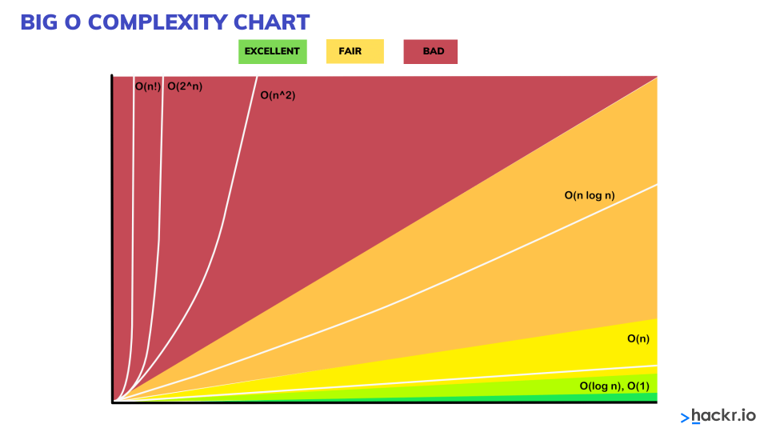

# Big O Rules

## 1. Worst Case

We only care about the worst case senario. E.g.,

<pre><code class="language-javascript">const everyone = ['dory', 'bruce', 'marlin', <mark><s>'nemo'</s></mark>,'gill','bloat','nigel','squirt','darla','hank',<mark>'nemo'</mark>]
function findNemo(array) {
  let t0 = performance.now();
  for (let i = 0; i < array.length; i++){
    if (array[i] === 'nemo') {
      console.log('Found Nemo!');
    }
  }
  let t1 = performance.now()
  console.log(t1 - t0)
}
</code></pre>

Even though in the array everyone nemo is in the _4th_ index. We assume that in the worst case it is in the last index.

## 2. Remove Constants

```js
function printFirstItemThenFirstHalfTehnSayHi100Times(items) {
  console.log(items[0]);
  let middle Index = Math.floor(items.length / 2);
  let index = 0;

  while (index < middleIndex) {
    console.log(items[index]);
    index++;
  }

  for (let i = 0; i < 100; i++) {
    console.log('hi');
  }
}
```

Even though the above is O(n/2 + 101). We dont care about the constants so it becomes O(n) because as it scales and approaches "Infinity".
<br>We dont care how steep the line is during interviews just how the line is moving.



<br>
